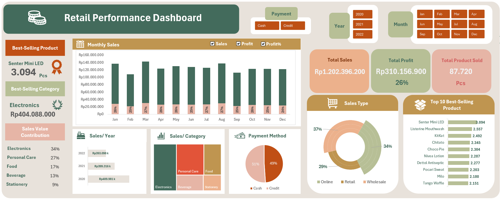

# **Retail Performance Dashboard - Excel**  

## **Overview**  
This project features a **Retail Performance Dashboard** built using **Microsoft Excel**. The dataset used was **generated with ChatGPT** and processed using various **Excel formulas** such as **VLOOKUP, XLOOKUP, IF, and Pivot Tables** to create an interactive and insightful dashboard.  

## **Dashboard Features**  
- **Best-Selling Product & Category** 🏆  
- **Monthly Sales Analysis** 📊  
- **Total Sales, Profit, and Product Sold** 💰  
- **Sales Breakdown by Year, Category, and Type** 📈  
- **Payment Method Distribution** 💳  
- **Top 10 Best-Selling Products** 📦  

## **Dashboard Interface**  
  

## **Excel Functions Used**  
- **VLOOKUP & XLOOKUP** for data retrieval  
- **IF statements** for conditional logic  
- **Pivot Tables** for dynamic data aggregation  
- **Slicers** for interactive filtering  

This dashboard provides valuable insights into retail performance, helping businesses track sales trends, profit margins, and top-performing products efficiently.  
